
## Basic syntax

### A link

```csharp
Flowchart.Start()
    .WithNode(Node.Named("A"))
    .WithNode(Node.Named("B"))
    .WithLink(LinkBuilder.From(Node.Named("A"))
        .To(Node.Named("B")))
```

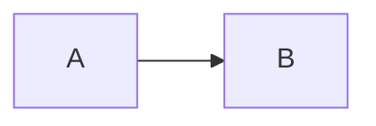
### A link with undeclared nodes

```csharp
Flowchart.Start()
    .WithLink(LinkBuilder.From(Node.Named("A"))
        .To(Node.Named("B")))
```


### An empty flow chart is not a valid chart

```csharp
Flowchart.Start()
```

```mermaid
flowchart LR
```
### A node

```csharp
Flowchart.Start()
    .WithNode(Node.Named("id"))
```

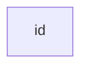
### A node with modified text

```csharp
Flowchart.Start()
    .WithNode(Node.Named(new MermaidName("id1"))
        .Labeled("This is the text in the box"))
```

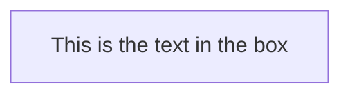
### A node with text

```csharp
Flowchart.Start()
    .WithNode(Node.Named(new MermaidName("id1", "This is the text in the box")))
```


### Multiple nodes

```csharp
Flowchart.Start()
    .WithNode(Node.Named("A"))
    .WithNode(Node.Named("B"))
```

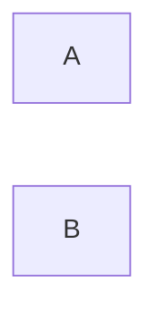
### Multiple nodes with unique declaration

```csharp
Flowchart.Start()
    .WithNodes(new [] {Node.Named("A"), Node.Named("B")})
```


## Orientation

### Oriented flowchart( bottom to top)

```csharp
Flowchart.Start(Orientation.BottomToTop)
    .WithLink(LinkBuilder.From(Node.Named("Start"))
        .To(Node.Named("Stop")))
```

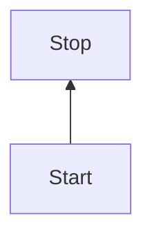
### Oriented flowchart( left to right)

```csharp
Flowchart.Start(Orientation.LeftToRight)
    .WithLink(LinkBuilder.From(Node.Named("Start"))
        .To(Node.Named("Stop")))
```

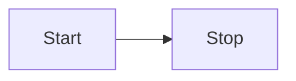
### Oriented flowchart( right to left)

```csharp
Flowchart.Start(Orientation.RightToLeft)
    .WithLink(LinkBuilder.From(Node.Named("Start"))
        .To(Node.Named("Stop")))
```

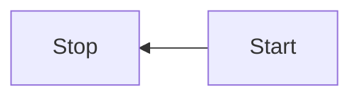
### Oriented flowchart( top to bottom)

```csharp
Flowchart.Start(Orientation.TopToBottom)
    .WithLink(LinkBuilder.From(Node.Named("Start"))
        .To(Node.Named("Stop")))
```

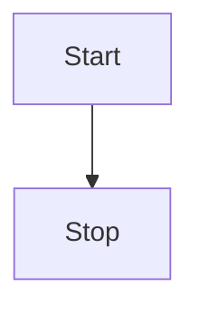
## Node shapes

### A hexagon node

```csharp
Flowchart.Start()
    .WithNode(Node.Named("id")
        .Shaped(NodeShape.Hexagon))
```

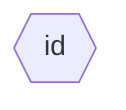
### An alternative parallelogram node

```csharp
Flowchart.Start()
    .WithNode(Node.Named("id")
        .Shaped(NodeShape.ParallelogramAlt))
```

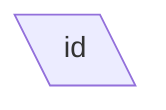
### An alternative trapezoid node

```csharp
Flowchart.Start()
    .WithNode(Node.Named("id")
        .Shaped(NodeShape.TrapezoidAlt))
```

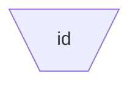
### A node in a cylindrical shape

```csharp
Flowchart.Start()
    .WithNode(Node.Named("id")
        .Shaped(NodeShape.Cylindrical))
```

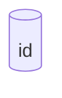
### A node in an asymmetric shape

```csharp
Flowchart.Start()
    .WithNode(Node.Named("id")
        .Shaped(NodeShape.Asymmetric))
```

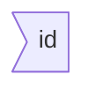
### A node in a subroutine shape

```csharp
Flowchart.Start()
    .WithNode(Node.Named("id")
        .Shaped(NodeShape.Subroutine))
```

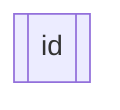
### A node in the form of a circle

```csharp
Flowchart.Start()
    .WithNode(Node.Named("id")
        .Shaped(NodeShape.Circle))
```

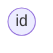
### A node with round edges

```csharp
Flowchart.Start()
    .WithNode(Node.Named("id")
        .Shaped(NodeShape.RoundEdges))
```

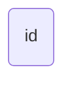
### A parallelogram node

```csharp
Flowchart.Start()
    .WithNode(Node.Named("id")
        .Shaped(NodeShape.Parallelogram))
```

```mermaid
flowchart LR
    id[/"id"/]
```
### A rhombus node

```csharp
Flowchart.Start()
    .WithNode(Node.Named("id")
        .Shaped(NodeShape.Rhombus))
```

```mermaid
flowchart LR
    id{"id"}
```
### A stadium shaped node

```csharp
Flowchart.Start()
    .WithNode(Node.Named("id")
        .Shaped(NodeShape.Stadium))
```

```mermaid
flowchart LR
    id(["id"])
```
### A trapezoid node

```csharp
Flowchart.Start()
    .WithNode(Node.Named("id")
        .Shaped(NodeShape.Trapezoid))
```

```mermaid
flowchart LR
    id[/"id"\]
```
## Links types

### A text on arrow link

```csharp
Flowchart.Start()
    .WithLink(LinkBuilder.From(Node.Named("A"))
        .To(Node.Named("B"))
        .WithText("This is the text"))
```

```mermaid
flowchart LR
    A -->|This is the text| B
```
### A text on open link

```csharp
Flowchart.Start()
    .WithLink(LinkBuilder.From(Node.Named("A"))
        .To(Node.Named("B"))
        .WithText("This is the text")
        .WithOptions(LinkOptions.Default
            .WithDirection(LinkDirection.None)))
```

```mermaid
flowchart LR
    A ---|This is the text| B
```
### Complex links

```csharp
Flowchart.Start()
    .WithLink(LinkBuilder.From(Node.Named("A"))
        .To(Node.Named("B1"))
        .WithOptions(LinkOptions.Default
            .WithHead(head)
            .WithDirection(direction)
            .WithLineType(lineType)
            .WithMinimumLength(1)))
    .WithLink(LinkBuilder.From(Node.Named("A"))
        .To(Node.Named("B2"))
        .WithOptions(LinkOptions.Default
            .WithHead(head)
            .WithDirection(direction)
            .WithLineType(lineType)
            .WithMinimumLength(2)))
    .WithLink(LinkBuilder.From(Node.Named("A"))
        .To(Node.Named("B3"))
        .WithOptions(LinkOptions.Default
            .WithHead(head)
            .WithDirection(direction)
            .WithLineType(lineType)
            .WithMinimumLength(3)))
```

<table>
<tr> <th>Head</th> <th>Direction</th> <th>LineType</th> <th>Result</th> </tr>


<tr>
<td> None </td> <td> Dual </td> <td> Straight </td>
<td>

```mermaid
flowchart LR
    A --- B1
    A ---- B2
    A ----- B3
```

</td>
</tr>
<tr>
<td> Circle </td> <td> None </td> <td> Straight </td>
<td>

```mermaid
flowchart LR
    A --- B1
    A ---- B2
    A ----- B3
```

</td>
</tr>
<tr>
<td> Arrow </td> <td> Single </td> <td> Straight </td>
<td>

```mermaid
flowchart LR
    A --> B1
    A ---> B2
    A ----> B3
```

</td>
</tr>
<tr>
<td> Circle </td> <td> Single </td> <td> Straight </td>
<td>

```mermaid
flowchart LR
    A --o B1
    A ---o B2
    A ----o B3
```

</td>
</tr>
<tr>
<td> Cross </td> <td> Single </td> <td> Straight </td>
<td>

```mermaid
flowchart LR
    A --x B1
    A ---x B2
    A ----x B3
```

</td>
</tr>
<tr>
<td> Arrow </td> <td> Dual </td> <td> Straight </td>
<td>

```mermaid
flowchart LR
    A <--> B1
    A <---> B2
    A <----> B3
```

</td>
</tr>
<tr>
<td> Circle </td> <td> Dual </td> <td> Straight </td>
<td>

```mermaid
flowchart LR
    A o--o B1
    A o---o B2
    A o----o B3
```

</td>
</tr>
<tr>
<td> Cross </td> <td> Dual </td> <td> Straight </td>
<td>

```mermaid
flowchart LR
    A x--x B1
    A x---x B2
    A x----x B3
```

</td>
</tr>
<tr>
<td> None </td> <td> None </td> <td> Thick </td>
<td>

```mermaid
flowchart LR
    A === B1
    A ==== B2
    A ===== B3
```

</td>
</tr>
<tr>
<td> Arrow </td> <td> Single </td> <td> Thick </td>
<td>

```mermaid
flowchart LR
    A ==> B1
    A ===> B2
    A ====> B3
```

</td>
</tr>
<tr>
<td> None </td> <td> None </td> <td> Dotted </td>
<td>

```mermaid
flowchart LR
    A -.- B1
    A -..- B2
    A -...- B3
```

</td>
</tr>
<tr>
<td> Arrow </td> <td> Single </td> <td> Dotted </td>
<td>

```mermaid
flowchart LR
    A -.-> B1
    A -..-> B2
    A -...-> B3
```

</td>
</tr>


</table>

## Interaction

### A clickable node

```csharp
Flowchart.Start()
    .WithNode(Node.Named("B")
        .ClickableToUrl("http://www.github.com"))
```

```mermaid
flowchart LR
    B
    click B href "http://www.github.com"
```
## Special characters that break syntax

### A node with invalid mermaid char in id(" banana🍌")

```csharp
Flowchart.Start()
    .WithNode(Node.Named(input))
```

```mermaid
flowchart LR
    Banana["Banana#127820;"]
```
### A node with invalid mermaid char in id("mon id")

```csharp
Flowchart.Start()
    .WithNode(Node.Named(input))
```

```mermaid
flowchart LR
    monid["mon id"]
```
### A node with invalid mermaid char in id("mon\"id")

```csharp
Flowchart.Start()
    .WithNode(Node.Named(input))
```

```mermaid
flowchart LR
    monid["mon&quot;id"]
```
### A node with label including quote

```csharp
Flowchart.Start()
    .WithNode(Node.Named(new MermaidName("id1", "A double quote:\"")))
```

```mermaid
flowchart LR
    id1["A double quote:&quot;"]
```
## Subgraphs

### A linked subgraph

```csharp
Flowchart.Start()
    .WithNode(Node.Named("A1"))
    .WithSubgraph(subgraphWithANodeNameA2)
    .WithLink(LinkBuilder.From(Node.Named("A1"))
        .To(subgraphWithANodeNameA2))
```

```mermaid
flowchart LR
    A1
    subgraph Mysubgraph["My sub graph"]
        A2
    end
    A1 --> Mysubgraph
```
### A named subgraph

```csharp
Flowchart.Start()
    .WithNode(Node.Named("A1"))
    .WithNode(Node.Named("B1"))
    .WithLink(LinkBuilder.From(Node.Named("A1"))
        .To(Node.Named("B1")))
    .WithSubgraph(new Subgraph(new MermaidName("subId", "My Sub Name"), Flowchart.Start()
        .WithNode(Node.Named("A2"))
        .WithNode(Node.Named("B2"))
        .WithLink(LinkBuilder.From(Node.Named("A2"))
            .To(Node.Named("B2")))))
```

```mermaid
flowchart LR
    A1
    B1
    subgraph subId["My Sub Name"]
        A2
        B2
        A2 --> B2
    end
    A1 --> B1
```
### An oriented subgraph

```csharp
Flowchart.Start()
    .WithSubgraph(new Subgraph("subId", Flowchart.Start(Orientation.TopToBottom)
        .WithNode(Node.Named("A2"))
        .WithNode(Node.Named("B2"))
        .WithLink(LinkBuilder.From(Node.Named("A2"))
            .To(Node.Named("B2")))))
```

```mermaid
flowchart LR
    subgraph subId
        direction TB
        A2
        B2
        A2 --> B2
    end
```
### A subgraph

```csharp
Flowchart.Start()
    .WithNode(Node.Named("A1"))
    .WithNode(Node.Named("B1"))
    .WithLink(LinkBuilder.From(Node.Named("A1"))
        .To(Node.Named("B1")))
    .WithSubgraph(new Subgraph("subId", Flowchart.Start()
        .WithNode(Node.Named("A2"))
        .WithNode(Node.Named("B2"))
        .WithLink(LinkBuilder.From(Node.Named("A2"))
            .To(Node.Named("B2")))))
```

```mermaid
flowchart LR
    A1
    B1
    subgraph subId
        A2
        B2
        A2 --> B2
    end
    A1 --> B1
```
## Styling

### Styling a node by class

```csharp
Flowchart.Start()
    .WithNode(Node.Named("id1")
        .Styled(new NodeStyleClass("my_Class_Name", nodeStyle1)))
    .WithNode(Node.Named("id2")
        .Styled(new NodeStyleClass("my_Class_Name", nodeStyle1)))
    .WithNode(Node.Named("id3")
        .Styled(styleClass2))
    .WithNode(Node.Named("id4")
        .Styled(styleClass2))
```

```mermaid
flowchart LR
    classDef myClassName fill:#bbf,stroke:#f66,stroke-width:2px,color:#fff,stroke-dasharray:5 5;
    classDef mysecondClassName fill:#ffb,stroke:#66f,stroke-width:4px,color:#330,stroke-dasharray:1 1 1 1 1 1 2 2 2 2 2 2 1 1 1 1 1 1;
    id1
    class id1 myClassName;
    id2
    class id2 myClassName;
    id3
    class id3 mysecondClassName;
    id4
    class id4 mysecondClassName;
```
### Styling a node by class in a sub graph

```csharp
Flowchart.Start()
    .WithNode(Node.Named("id1")
        .Styled(outerClassRed))
    .WithNode(Node.Named("id2")
        .Styled(sharedClassGreen))
    .WithSubgraph(new Subgraph("sub", Flowchart.Start()
        .WithNode(Node.Named("id3")
            .Styled(sharedClassGreen))
        .WithNode(Node.Named("id4")
            .Styled(innerClassBlue))))
```

```mermaid
flowchart LR
    classDef outerClassRed fill:#f00;
    classDef sharedClassGreen fill:#0f0;
    classDef innerClassBlue fill:#00f;
    id1
    class id1 outerClassRed;
    id2
    class id2 sharedClassGreen;
    subgraph sub
        id3
        class id3 sharedClassGreen;
        id4
        class id4 innerClassBlue;
    end
```
### Styling a node by css builder

```csharp
Flowchart.Start()
    .WithNode(Node.Named("id2")
        .Styled(NodeStyleBuilder.Start()
            .Fill("#bbf")
            .Stroke("#f66")
            .StrokeWidth("2px")
            .Color("#fff")
            .StrokeDashArray(new [] {5, 5})))
```

```mermaid
flowchart LR
    id2
    style id2 fill:#bbf,stroke:#f66,stroke-width:2px,color:#fff,stroke-dasharray:5 5
```
### Styling a node by raw css

```csharp
Flowchart.Start()
    .WithNode(Node.Named("id1")
        .Styled("fill:#f9f,stroke:#333,stroke-width:4px"))
```

```mermaid
flowchart LR
    id1
    style id1 fill:#f9f,stroke:#333,stroke-width:4px
```
### Styling link

```csharp
Flowchart.Start()
    .WithLink(LinkBuilder.From(Node.Named("A"))
        .To(Node.Named("B")))
    .WithLink(LinkBuilder.From(Node.Named("C"))
        .To(Node.Named("D"))
        .Styled("stroke:#ff3,stroke-width:4px,color:red;"))
    .WithLink(LinkBuilder.From(Node.Named("E"))
        .To(Node.Named("F")))
```

```mermaid
flowchart LR
    A --> B
    C --> D
    E --> F
    linkStyle 1 stroke:#ff3,stroke-width:4px,color:red;
```
### Styling nodes by default

```csharp
Flowchart.Start()
    .WithDefaultNodeStyle(NodeStyleBuilder.Start()
        .Fill("#bbf"))
    .WithNode(Node.Named("id1"))
```

```mermaid
flowchart LR
    classDef default fill:#bbf;
    id1
```
### Styling nodes by default exists only on root chart

```csharp
Flowchart.Start()
    .WithNode(nodeNamedA1)
    .WithSubgraph(subgraphWithA2NodeAndDefaultNodeStyle)
    .WithLink(LinkBuilder.From(nodeNamedA1)
        .To(subgraphWithA2NodeAndDefaultNodeStyle))
```

```mermaid
flowchart LR
    A1
    subgraph subId
        A2
    end
    A1 --> subId
```
### Styling subgraph

```csharp
Flowchart.Start()
    .WithSubgraph(SubgraphBuilder.Named("subId")
        .WithContent(Flowchart.Start())
        .Styled(NodeStyleBuilder.Start()
            .Fill("#bbf")))
```

```mermaid
flowchart LR
    subgraph subId

    end
    style subId fill:#bbf
```
### Styling subgraph by class

```csharp
Flowchart.Start()
    .WithSubgraph(SubgraphBuilder.Named("subId")
        .WithContent(Flowchart.Start())
        .Styled(new NodeStyleClass("MyClass", NodeStyleBuilder.Start()
            .Fill("#bbf"))))
```

```mermaid
flowchart LR
    classDef MyClass fill:#bbf;
    subgraph subId

    end
    class subId MyClass;
```
## Appending flowcharts

### Append links

```csharp
Flowchart.Start()
    .WithLink(new Link(Node.Named("a"), Node.Named("b")))
    .Append(Flowchart.Start()
        .WithLink(new Link(Node.Named("c"), Node.Named("d"))))
```

```mermaid
flowchart LR
    a --> b
    c --> d
```
### Append nodes

```csharp
Flowchart.Start()
    .WithNode(Node.Named("Original"))
    .Append(Flowchart.Start()
        .WithNode(Node.Named("ToAppend")))
```

```mermaid
flowchart LR
    Original
    ToAppend
```
### Append subgraphs

```csharp
Flowchart.Start()
    .WithSubgraph(new Subgraph("subA", Flowchart.Start()
        .WithNode(Node.Named("A"))))
    .Append(Flowchart.Start()
        .WithSubgraph(new Subgraph("subB", Flowchart.Start()
            .WithNode(Node.Named("B")))))
```

```mermaid
flowchart LR
    subgraph subA
        A
    end
    subgraph subB
        B
    end
```
### Keeps first flow chart orientation

```csharp
Flowchart.Start(Orientation.BottomToTop)
    .WithLink(LinkBuilder.From(Node.Named("a"))
        .To(Node.Named("b")))
    .Append(Flowchart.Start(Orientation.RightToLeft)
        .WithLink(LinkBuilder.From(Node.Named("c"))
            .To(Node.Named("d"))))
```

```mermaid
flowchart BT
    a --> b
    c --> d
```