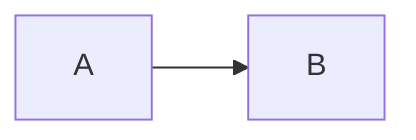

### A link

```csharp
Flowchart.Start()
    .WithNode(Node.Named("A"))
    .WithNode(Node.Named("B"))
    .WithLink(LinkBuilder.From(Node.Named("A"))
        .To(Node.Named("B")))
```


```mermaid
flowchart LR
    A
    B
    A --> B
```