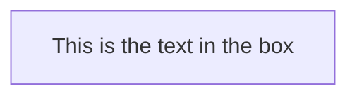

### A node with modified text

```csharp
Flowchart.Start()
    .WithNode(Node.Named(new MermaidName("id1"))
        .Labeled("This is the text in the box"))
```


```mermaid
flowchart LR
    id1["This is the text in the box"]
```