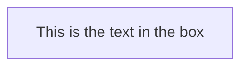

### A node with text

```csharp
Flowchart.Start()
    .WithNode(Node.Named(new MermaidName("id1", "This is the text in the box")))
```


```mermaid
flowchart LR
    id1["This is the text in the box"]
```