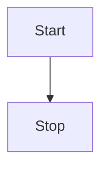

### Oriented flowchart( top to bottom)

```csharp
Flowchart.Start(Orientation.TopToBottom)
    .WithLink(LinkBuilder.From(Node.Named("Start"))
        .To(Node.Named("Stop")))
```


```mermaid
flowchart TB
    Start --> Stop
```