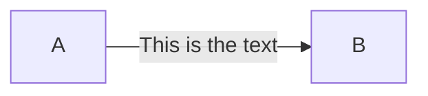

### A text on arrow link

```csharp
Flowchart.Start()
    .WithLink(LinkBuilder.From(Node.Named("A"))
        .To(Node.Named("B"))
        .WithText("This is the text"))
```


```mermaid
flowchart LR
    A -->|This is the text| B
```