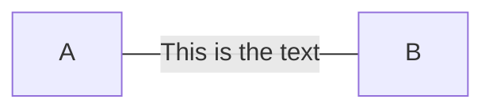

### A text on open link

```csharp
Flowchart.Start()
    .WithLink(LinkBuilder.From(Node.Named("A"))
        .To(Node.Named("B"))
        .WithText("This is the text")
        .WithOptions(LinkOptions.Default
            .WithDirection(LinkDirection.None)))
```

