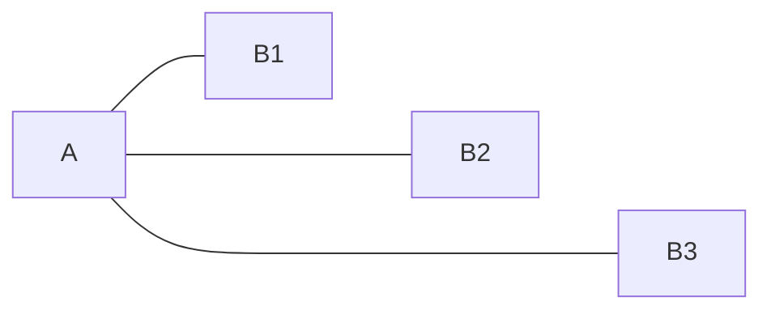
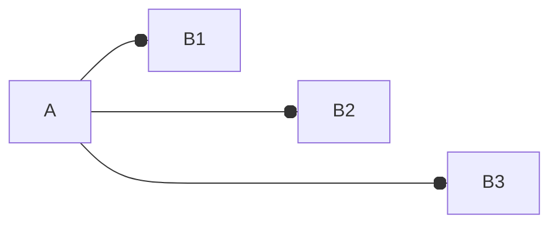
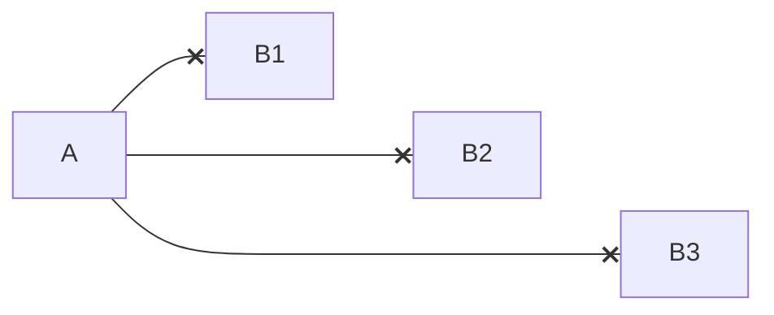
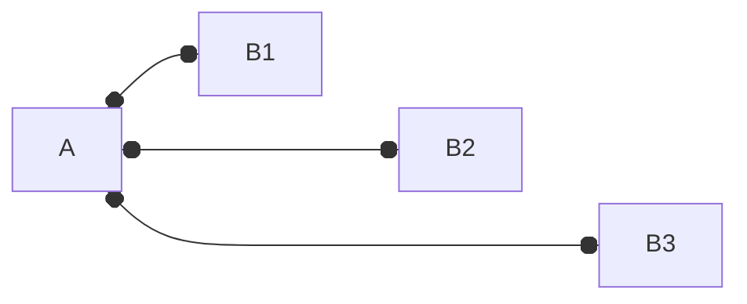
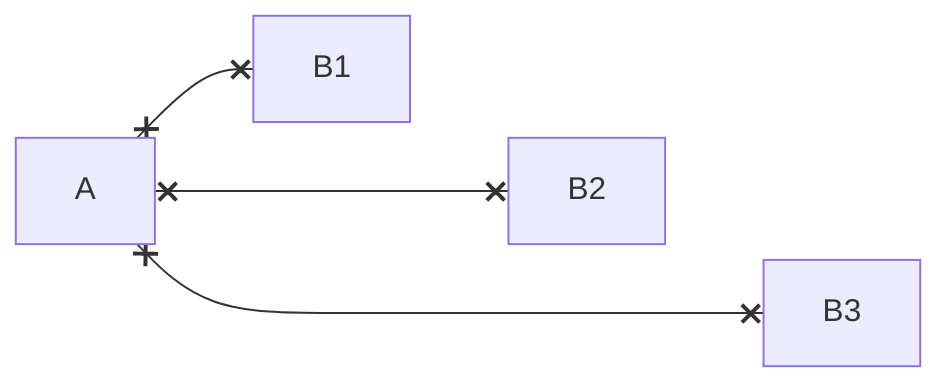
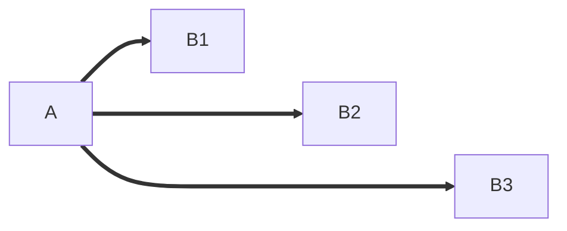
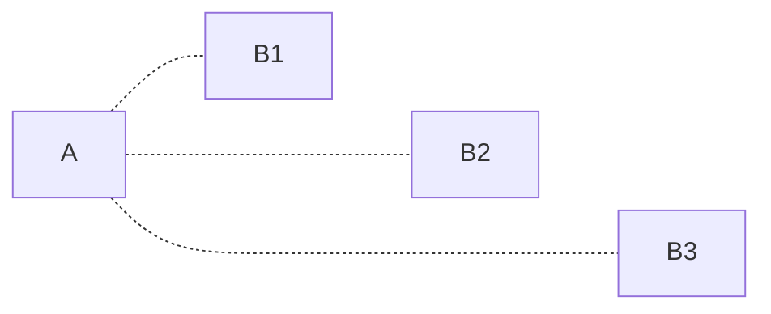
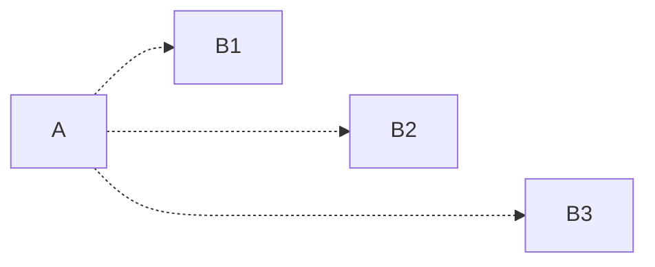

### Complex links

```csharp
Flowchart.Start()
    .WithLink(LinkBuilder.From(Node.Named("A"))
        .To(Node.Named("B1"))
        .WithOptions(LinkOptions.Default
            .WithHead(head)
            .WithDirection(direction)
            .WithLineType(lineType)
            .WithMinimumLength(1)))
    .WithLink(LinkBuilder.From(Node.Named("A"))
        .To(Node.Named("B2"))
        .WithOptions(LinkOptions.Default
            .WithHead(head)
            .WithDirection(direction)
            .WithLineType(lineType)
            .WithMinimumLength(2)))
    .WithLink(LinkBuilder.From(Node.Named("A"))
        .To(Node.Named("B3"))
        .WithOptions(LinkOptions.Default
            .WithHead(head)
            .WithDirection(direction)
            .WithLineType(lineType)
            .WithMinimumLength(3)))
```

<table>
<tr> <th>Head</th> <th>Direction</th> <th>LineType</th> <th>Result</th> </tr>


<tr>
<td> None </td> <td> Dual </td> <td> Straight </td>
<td>



</td>
</tr>
<tr>
<td> Circle </td> <td> None </td> <td> Straight </td>
<td>


</td>
</tr>
<tr>
<td> Arrow </td> <td> Single </td> <td> Straight </td>
<td>


</td>
</tr>
<tr>
<td> Circle </td> <td> Single </td> <td> Straight </td>
<td>



</td>
</tr>
<tr>
<td> Cross </td> <td> Single </td> <td> Straight </td>
<td>



</td>
</tr>
<tr>
<td> Arrow </td> <td> Dual </td> <td> Straight </td>
<td>


</td>
</tr>
<tr>
<td> Circle </td> <td> Dual </td> <td> Straight </td>
<td>



</td>
</tr>
<tr>
<td> Cross </td> <td> Dual </td> <td> Straight </td>
<td>



</td>
</tr>
<tr>
<td> None </td> <td> None </td> <td> Thick </td>
<td>


</td>
</tr>
<tr>
<td> Arrow </td> <td> Single </td> <td> Thick </td>
<td>



</td>
</tr>
<tr>
<td> None </td> <td> None </td> <td> Dotted </td>
<td>



</td>
</tr>
<tr>
<td> Arrow </td> <td> Single </td> <td> Dotted </td>
<td>



</td>
</tr>


</table>
