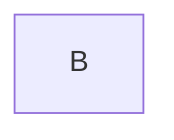

### A clickable node

```csharp
Flowchart.Start()
    .WithNode(Node.Named("B")
        .ClickableToUrl("http://www.github.com"))
```


```mermaid
flowchart LR
    B
    click B href "http://www.github.com"
```