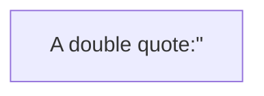

### A node with label including quote

```csharp
Flowchart.Start()
    .WithNode(Node.Named(new MermaidName("id1", "A double quote:\"")))
```


```mermaid
flowchart LR
    id1["A double quote:&quot;"]
```