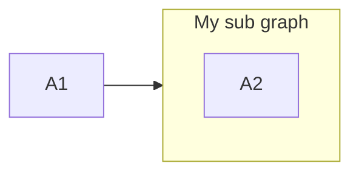

### A linked subgraph

```csharp
Flowchart.Start()
    .WithNode(Node.Named("A1"))
    .WithSubgraph(subgraphWithANodeNameA2)
    .WithLink(LinkBuilder.From(Node.Named("A1"))
        .To(subgraphWithANodeNameA2))
```

