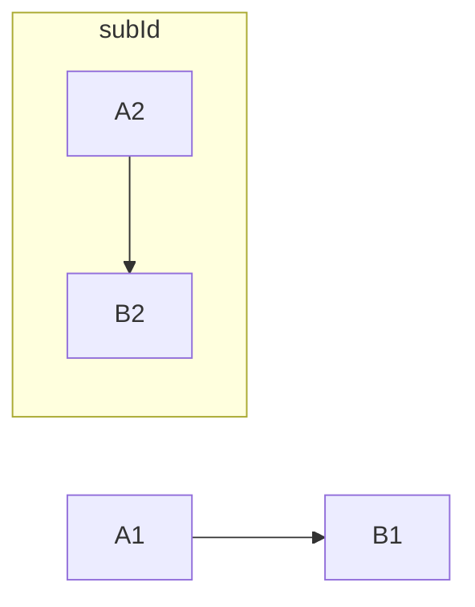

### A subgraph

```csharp
Flowchart.Start()
    .WithNode(Node.Named("A1"))
    .WithNode(Node.Named("B1"))
    .WithLink(LinkBuilder.From(Node.Named("A1"))
        .To(Node.Named("B1")))
    .WithSubgraph(new Subgraph("subId", Flowchart.Start()
        .WithNode(Node.Named("A2"))
        .WithNode(Node.Named("B2"))
        .WithLink(LinkBuilder.From(Node.Named("A2"))
            .To(Node.Named("B2")))))
```

