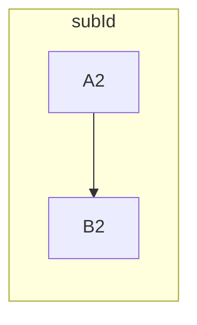

### An oriented subgraph

```csharp
Flowchart.Start()
    .WithSubgraph(new Subgraph("subId", Flowchart.Start(Orientation.TopToBottom)
        .WithNode(Node.Named("A2"))
        .WithNode(Node.Named("B2"))
        .WithLink(LinkBuilder.From(Node.Named("A2"))
            .To(Node.Named("B2")))))
```

