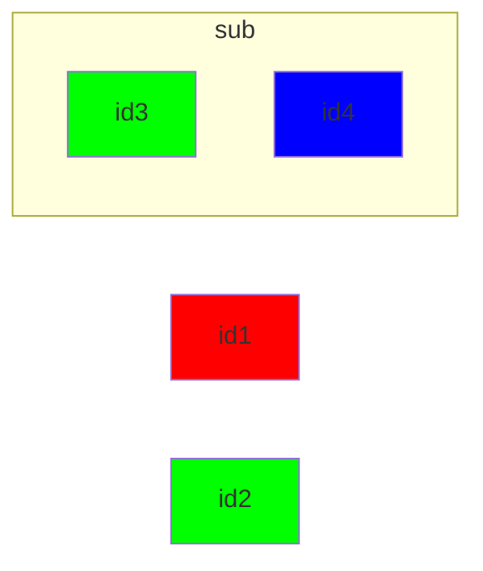

### Styling a node by class in a sub graph

```csharp
Flowchart.Start()
    .WithNode(Node.Named("id1")
        .Styled(outerClassRed))
    .WithNode(Node.Named("id2")
        .Styled(sharedClassGreen))
    .WithSubgraph(new Subgraph("sub", Flowchart.Start()
        .WithNode(Node.Named("id3")
            .Styled(sharedClassGreen))
        .WithNode(Node.Named("id4")
            .Styled(innerClassBlue))))
```

