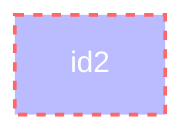

### Styling a node by css builder

```csharp
Flowchart.Start()
    .WithNode(Node.Named("id2")
        .Styled(NodeStyleBuilder.Start()
            .Fill("#bbf")
            .Stroke("#f66")
            .StrokeWidth("2px")
            .Color("#fff")
            .StrokeDashArray(new [] {5, 5})))
```

