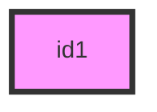

### Styling a node by raw css

```csharp
Flowchart.Start()
    .WithNode(Node.Named("id1")
        .Styled("fill:#f9f,stroke:#333,stroke-width:4px"))
```


```mermaid
flowchart LR
    id1
    style id1 fill:#f9f,stroke:#333,stroke-width:4px
```