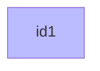

### Styling nodes by default

```csharp
Flowchart.Start()
    .WithDefaultNodeStyle(NodeStyleBuilder.Start()
        .Fill("#bbf"))
    .WithNode(Node.Named("id1"))
```


```mermaid
flowchart LR
    classDef default fill:#bbf;
    id1
```