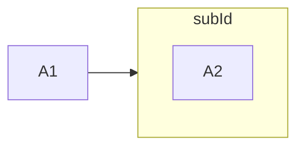

### Styling nodes by default exists only on root chart

```csharp
Flowchart.Start()
    .WithNode(nodeNamedA1)
    .WithSubgraph(subgraphWithA2NodeAndDefaultNodeStyle)
    .WithLink(LinkBuilder.From(nodeNamedA1)
        .To(subgraphWithA2NodeAndDefaultNodeStyle))
```

