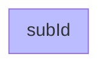

### Styling subgraph

```csharp
Flowchart.Start()
    .WithSubgraph(SubgraphBuilder.Named("subId")
        .WithContent(Flowchart.Start())
        .Styled(NodeStyleBuilder.Start()
            .Fill("#bbf")))
```

