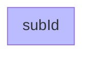

### Styling subgraph by class

```csharp
Flowchart.Start()
    .WithSubgraph(SubgraphBuilder.Named("subId")
        .WithContent(Flowchart.Start())
        .Styled(new NodeStyleClass("MyClass", NodeStyleBuilder.Start()
            .Fill("#bbf"))))
```

