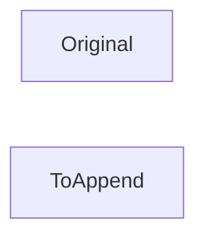

### Append nodes

```csharp
Flowchart.Start()
    .WithNode(Node.Named("Original"))
    .Append(Flowchart.Start()
        .WithNode(Node.Named("ToAppend")))
```


```mermaid
flowchart LR
    Original
    ToAppend
```