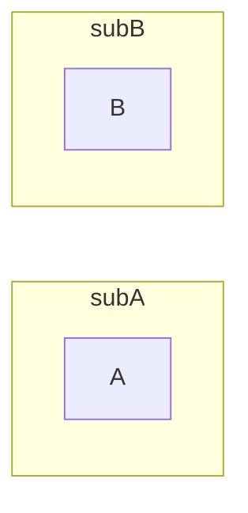

### Append subgraphs

```csharp
Flowchart.Start()
    .WithSubgraph(new Subgraph("subA", Flowchart.Start()
        .WithNode(Node.Named("A"))))
    .Append(Flowchart.Start()
        .WithSubgraph(new Subgraph("subB", Flowchart.Start()
            .WithNode(Node.Named("B")))))
```

