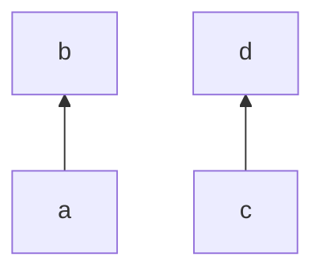

### Keeps first flow chart orientation

```csharp
Flowchart.Start(Orientation.BottomToTop)
    .WithLink(LinkBuilder.From(Node.Named("a"))
        .To(Node.Named("b")))
    .Append(Flowchart.Start(Orientation.RightToLeft)
        .WithLink(LinkBuilder.From(Node.Named("c"))
            .To(Node.Named("d"))))
```

